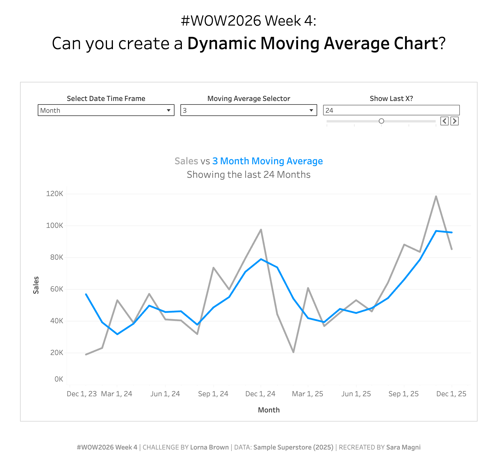

# WOW2026 Week 4: Dynamic Moving Average Chart

## Challenge

**Creator:** [Lorna Brown](https://public.tableau.com/app/profile/lorna.eden/vizzes)  
**Challenge Link:** [WOW2026 Week 4](https://www.workout-wednesday.com/2026w4tab/)   
**Data Source:** Sample Superstore (2025)

## My Solution (Tableau Dashboard)

### How to Use
In Tableau Desktop:
- Download the .twbx file from this repository
- Open in Tableau Desktop (2021.1 or later)
- Explore the interactive parameters
- Modify calculations as needed

In Tableau Public:
- Visit the [published dashboard](https://public.tableau.com/views/WOW2026Week4DynamicMovingAverageChart/wow26_w4?:language=en-US&:sid=&:redirect=auth&:display_count=n&:origin=viz_share_link)
- Use the parameter controls at the top
- Hover over data points for details
- Experiment with different time frames and moving average periods

## Requirements

- Display **Sales over time** as a **line chart**
- Calculate and display a **dynamic Moving Average line**
- Allow users to **adjust the moving average period** (3, 6, 9 or 12)
- Enable **switching between time granularities** (Week, Month, Quarter)
- Filter to **show only the last X periods** (user-defined)
- **Dynamic title** that updates based on parameter selections
- **Interactive tooltip** showing both Sales and Moving Average values

## Implementation

### Parameters

| Parameter | Type | Values | Default |
|-----------|------|--------|---------|
| **Select Date Time Frame** | String | Week, Month, Quarter | Month |
| **Moving Average Selector** | Integer | 3, 6, 9, 12 | 3 |
| **Show Last X?** | Integer | 1-120 (range) | 24 |

## Key Features

- **Dynamic Time Granularity** - Switch between Week, Month, and Quarter views
- **Flexible Moving Average** - Choose 3, 6, 9 or 12-period smoothing
- **Adjustable Time Window** - Display any number of recent periods
- **Interactive Tooltip** - Hover to see exact values
- **Responsive Title** - Updates automatically with parameter changes

## Technical Notes

Both **Moving Average** and **Last** are table calculations and require proper configuration:
- **Compute Using:** Table (across) or Specific Dimensions
- **At the level:** Date dimension

The moving average calculates across N periods including the current one. Parameter values are internally adjusted (displayed value minus 1) to achieve the correct window size with the formula `WINDOW_AVG(SUM([Sales]), -N, 0)`.

## Author

**Sara Magni**  
*Data Analyst*

[sara.m4gn1.data@gmail.com](mailto:sara.m4gn1.data@gmail.com) | [LinkedIn](https://www.linkedin.com/in/sara-m4gn1/) | [GitHub](https://github.com/Sara-Magni)

